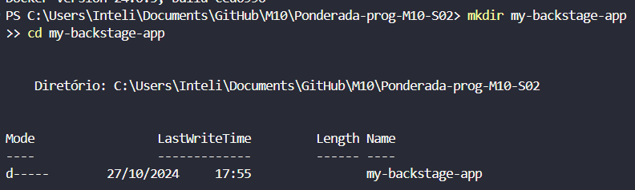
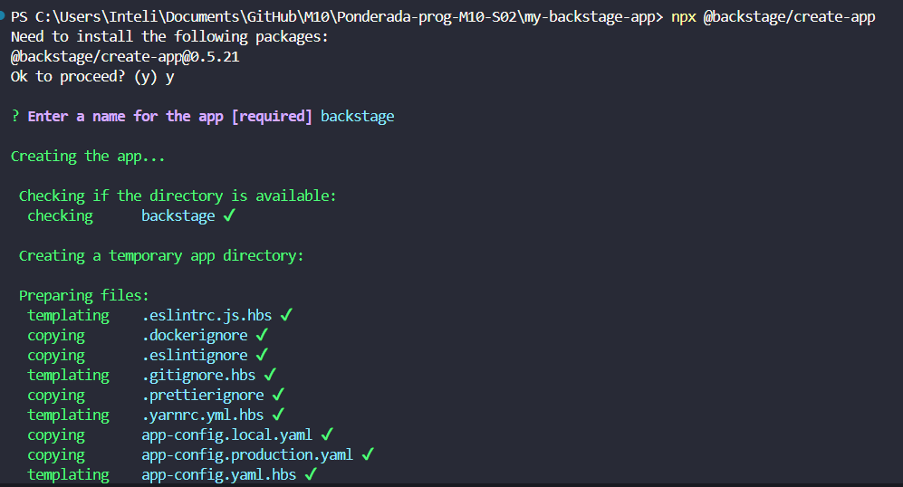
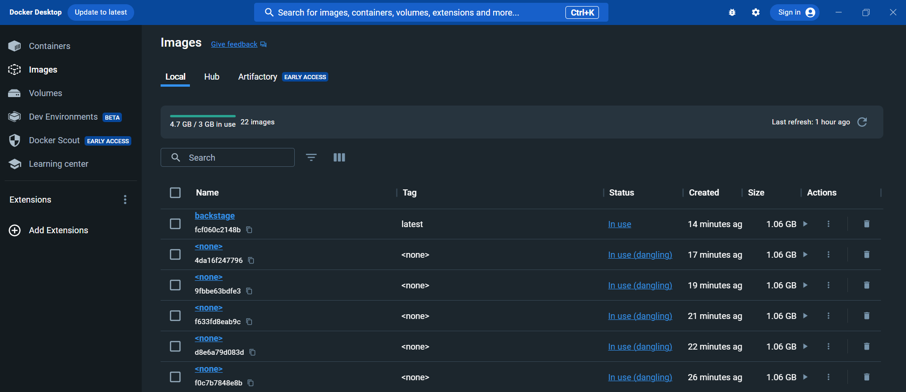
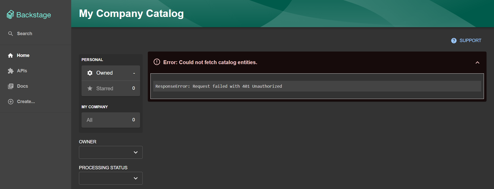

#  Configuração e Execução do Backstage

## Introdução

O Backstage é uma plataforma de desenvolvimento open-source criada pela Spotify para simplificar e centralizar o gerenciamento de serviços e infraestrutura de software dentro de uma organização. Ele foi projetado para ajudar equipes de desenvolvimento a gerenciar e organizar seus serviços, criando um catálogo unificado que facilita a visualização, a documentação e a manutenção de diversos componentes de software. Com uma interface amigável, o Backstage permite que desenvolvedores acessem rapidamente informações críticas sobre cada serviço, como status de deploys, logs, dependências, e mais. Através do uso de plugins, ele pode ser personalizado para atender a diversas necessidades específicas das equipes, integrando-se com ferramentas e sistemas já utilizados na organização.yarn install

## Requisitos
Pré-requisitos
Antes de iniciar, é preciso ter os seguintes softwares instalados:

- Docker
- Node.js e npm
- Git

## Configuração e Execução do Backstage

Abaixo estão as instruções detalhadas para configurar e rodar o Backstage no Docker:

### 1. Instalar as Dependências

No diretório principal do repositório clonado, instale as dependências com o comando:

```
npm install --global yarn
```

Verifique se foi instalado com sucesso instalação:

```
yarn --version
```

### 2. Instalar Backstage

Com o Yarn já configurado e sabendo que temos o Docker instalado, vamos instalar o Backstage.

#### 1. Crie um diretório para o novo projeto:

````
mkdir my-backstage-app
cd my-backstage-app
````



#### 2. Use o comando do Backstage CLI para criar um novo projeto:

````
npx @backstage/create-app
````



#### 3. Instalande as dependências do Yarn:

Dentro do diretório criado "my-backstage-app", dê o comando:

````
yarn install
````

### 3. Configurando o Banco de Dados PostgreSQL

Para que o Backstage funcione corretamente, ele precisa de um banco de dados PostgreSQL. Vamos configurar o PostgreSQL em um container Docker e conectá-lo ao Backstage.

#### 1. Iniciar o PostgreSQL com Docker

Execute o seguinte comando para criar e iniciar um container Docker com PostgreSQL:

````
docker run --name backstage-postgres -e POSTGRES_USER=postgres -e POSTGRES_PASSWORD=postgres -e POSTGRES_DB=backstage_plugin_app -p 5432:5432 -d postgres
````

#### 2. Criar uma Rede Docker Compartilhada

Para permitir que o container do Backstage e o container do PostgreSQL se comuniquem, crie uma rede Docker compartilhada:

````
docker network create backstage-network
````

#### 3. Conectar o PostgreSQL à Rede

Conecte o container do PostgreSQL à rede backstage-network:

````
docker network connect backstage-network backstage-postgres
````

#### 4. Configurar a Conexão com o Banco de Dados no Backstage

No arquivo app-config.yaml do Backstage, configure as credenciais do banco de dados para que ele utilize o PostgreSQL no Docker. Ajuste a configuração como abaixo:

```
backend:
  database:
    client: pg
    connection:
      host: backstage-postgres # Nome do container do PostgreSQL na mesma rede
      port: 5432
      user: postgres
      password: postgres
      database: backstage_plugin_app
```

### 4. Construir e Executar o Backstage com Docker

Agora que o PostgreSQL está configurado, podemos construir e executar o Backstage em um container Docker.

#### 1. Construir a Imagem Docker do Backstage

No diretório onde o Dockerfile do Backstage está localizado, execute o seguinte comando:

````
docker build -t backstage .
````


#### 2. Executar o Container do Backstage na Rede Compartilhada

Agora, execute o Backstage e conecte-o à rede backstage-network para que ele se comunique com o PostgreSQL:

````
docker run --network backstage-network -p 7007:7007 backstage
````

O Backstage deve agora estar rodando em http://localhost:7007 e conectado ao PostgreSQL.



### Conclusão

A configuração do Backstage com Docker possibilita um ambiente de desenvolvimento onde é possível visualizar e gerenciar diversos componentes e serviços centralizadamente. Este tutorial permite que outros reproduzam o ambiente com facilidade e utilizem a plataforma Backstage para consolidar o gerenciamento de serviços e infraestrutura.